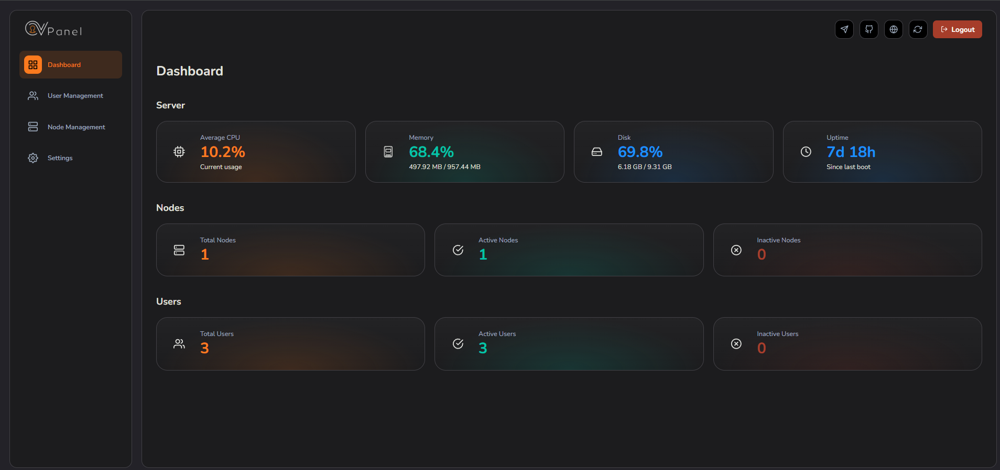

# Welcome to OVPanel

  

    
    

      <strong>OVPanel</strong> is an open-source, powerful and modern web application designed to create, manage, and monitor OVPN clients across multiple servers. It provides an intuitive dashboard, automation tools, and API integration to make server and user management simple and efficient.
    

    

      <a href="installation/Panel/install/" class="md-button md-button--primary">Get Started</a>
      <a href="https://github.com/primeZdev/ov-panel" target="_blank" class="md-button">View on GitHub</a>
    

  

---

## ✨ Key Features

  

    
👥

    <h3>Easy Client Management</h3>
    
Create and manage OVPN clients with just a few clicks through an intuitive interface.

  

  
  

    
🖥️

    <h3>Multi-Server Support</h3>
    
Manage multiple servers from a single dashboard with real-time monitoring and statistics.

  

  
  

    
🔒

    <h3>Secure API</h3>
    
Powerful REST API for automation and integration with your existing tools and workflows.

  

  
  

    
📱

    <h3>Mobile-Friendly</h3>
    
Beautiful, responsive web interface that works perfectly on desktop, tablet, and mobile devices.

  

  
  

    
📊

    <h3>Real-Time Monitoring</h3>
    
Track server performance in real-time.

  

  
  

    
⚡

    <h3>Fast & Efficient</h3>
    
Optimized performance with modern technologies for lightning-fast operations.

  

---

## 🚀 Quick Start

Whether you're managing a single server or running a large-scale VPN service, **OVPanel** helps you do it effortlessly.

1. **[Install Panel](installation/Panel/install/)** - Set up the control panel on your server
2. **[Configure Panel](installation/Panel/configuration/)** - Customize settings and preferences
3. **[Install Nodes](installation/Node/install/)** - Add additional servers to your network
4. **[Explore Awesome Projects](awesome/)** - Discover community tools and integrations

---
